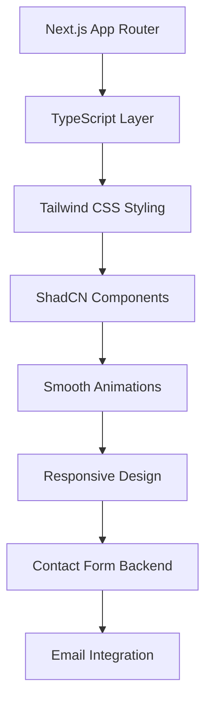

# 🚀 Aaditya Panda - Personal Portfolio

<div align="center">

[](https://your-portfolio-url.com)
[](https://github.com/AadityaPanda)
[](https://www.linkedin.com/in/aadityapanda/)

**A modern, responsive portfolio showcasing my journey as a Software Developer** ✨

</div>

---

## 👨‍💻 About Me

> *Passionate. Driven. Solution-Oriented.*

I am a **Software Developer** with a relentless passion for crafting robust, full-stack web applications from the ground up. My expertise lies in transforming complex problems into elegant digital solutions.

🎯 **What I Do:**
- 🏗️ **Architect** custom software solutions from concept to deployment
- ⚡ **Enhance** existing applications with cutting-edge features
- 🔄 **Manage** complete project lifecycles with precision
- 🎨 **Design** user-centric interfaces that deliver exceptional experiences

---

## 🛠️ Tech Stack & Features

<div align="center">

### 💼 **Built With Modern Technologies**

</div>

| Category | Technologies |
|----------|-------------|
| 🎨 **Frontend** |    |
| 🎭 **Styling** |   |
| ⚡ **Performance** |  CSS Animations |
| 🔧 **Backend** |   |

### ✨ **Standout Features**

<table>
<tr>
<td align="center" width="33%">

🎨 **Visual Excellence**
<br><sub>Sleek design with light/dark modes</sub>

</td>
<td align="center" width="33%">

⚡ **Smooth Experience**  
<br><sub>Buttery animations & transitions</sub>

</td>
<td align="center" width="33%">

📱 **Fully Responsive**
<br><sub>Perfect on every device</sub>

</td>
</tr>
<tr>
<td align="center" width="33%">

🔄 **Dynamic Content**
<br><sub>Centrally managed data</sub>

</td>
<td align="center" width="33%">

📧 **Smart Contact Form**
<br><sub>SMTP-powered messaging</sub>

</td>
<td align="center" width="33%">

🚀 **Performance Optimized**
<br><sub>Lightning-fast loading</sub>

</td>
</tr>
</table>

---

## 🎯 Project Highlights

<div align="center">

### 🏆 **What Makes This Portfolio Special**

</div>

```typescript
const portfolioFeatures = {
  design: "Modern & Professional 🎨",
  performance: "Optimized for Speed ⚡",
  accessibility: "WCAG Compliant ♿",
  seo: "Search Engine Optimized 🔍",
  animations: "Micro-interactions Everywhere ✨"
};
```

---

## 🌟 Performance Metrics

<div align="center">


</div>

---

## 🤝 Let's Connect!

<div align="center">

I'm always excited to discuss **new projects**, **creative ideas**, or **collaboration opportunities**!

<br>

[](https://www.linkedin.com/in/aadityapanda/)
[](https://github.com/AadityaPanda)
[](https://www.instagram.com/_aaditya_panda_/)
[](mailto:your-email@example.com)

</div>

---

<div align="center">

### 💡 **"Code is like humor. When you have to explain it, it's bad."** 

*Let's build something amazing together!* 🚀

<br>

⭐ **Star this repo if you found it interesting!** ⭐

<br>


[](https://github.com/AadityaPanda)

</div>

---

<details>
<summary><b>🔧 Technical Implementation Details</b></summary>

### Architecture Overview



### Key Technical Decisions

- **Next.js App Router**: For optimal routing and performance
- **TypeScript**: Type safety and better developer experience  
- **Tailwind CSS**: Utility-first approach for rapid styling
- **ShadCN UI**: Consistent, accessible component library
- **Lenis**: Smooth scrolling implementation
- **Genkit + Nodemailer**: Reliable contact form backend

</details>
